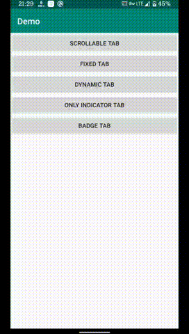

[](https://jitpack.io/#XuQK/KDTabLayout)

一直感觉[MagicIndicator](https://github.com/hackware1993/MagicIndicator)这个库相当牛逼，在自己的工作过程中也帮我解决了很多问题，无奈作者志向高远，已经转行不写代码了，所以我参考了一下该库，自己撸了一个TabLayout。

本TabLayout直接继承自ViewGroup，默认实现了一些简单的效果，也留出了接口供用户自定义单个Tab，Indicator，Badge等控件，可以和ViewPager2和ViewPager搭配使用。

效果图：



# 使用方式：

## 将JitPack存储库添加到构建文件(项目根目录下build.gradle文件)

```groovy
allprojects {
    repositories {
        ...
        maven { url 'https://jitpack.io' }
    }
}
```

## 添加依赖项

```groovy
// 版本号参看Release
implementation 'com.github.XuQK:KDTabLayout:versionCode'

// 项目依赖于以下库，如果没有需要在主工程中添加
implementation 'androidx.appcompat:appcompat:versionCode'
// 如果要使用ViewPager2，请添加ViewPager2库
implementation 'androidx.viewpager2:viewpager2:versionCode'
```

## 使用说明

### 简单使用

1. 将KDTabLayout添加到你的布局文件中

2. 为KDTabLayout配置Adapter

```kotlin
// KDTabLayout本身主要有tabMode和scrollBiasX两个属性可设置，具体见类field注释
tabLayout.contentAdapter = object : KDTabAdapter() {
    override fun createTab(position: Int): KDTab? {
        // 如果该方法返回null，则TabLayout只会绘制Indicator
        // 这是一个Tab中文字颜色和大小会随滚动进度变化的Tab
        return KDColorMorphingTextTab(context, data[position]).apply {
            horizontalPadding = 16f
            selectedTextColor = Color.parseColor("#ff5722")
            normalTextColor = Color.parseColor("#9e9e9e")
            setOnClickListener {
                viewPager2.currentItem = position
            }
        }
    }

    override fun createIndicator(): KDTabIndicator? {
        // 如果该方法返回null，则TabLayout不会绘制Indicator
        // 这是一个普通的矩形Indicator
        return KDRecIndicator(tab2).apply {
            indicatorHeight = 6f
            color = 0xffff5722.toInt()
            cornerRadius = 3f
            mode = KDRecIndicator.MODE_EXACT
            indicatorWidth = 16f
            startInterpolator = AccelerateInterpolator()
            endInterpolator = DecelerateInterpolator(2f)
        }
    }

    override fun getTabCount(): Int {
        return ZH.size
    }
}

// 与ViewPager2联动
tabLayout.setViewPager2(viewPager2)
// 与ViewPager联动
tabLayout.setViewPager(viewPager)
```

以上配置后，即可顺利使用。

### 自定义Tab

只需继承`KDTab`，然后根据需要重写其中方法即可

```kotlin
class XTab(context: Context) : KDTab(context) {
    /**
     * @param selectedFraction 该Tab被选中的比例，即滚动完成度
     * @param selectedInLeft 该Tab是否是从左边滚动到右边
     */
    override fun onScrolling(selectedFraction: Float, selectedInLeft: Boolean) {
        TODO("not implemented") //To change body of created functions use File | Settings | File Templates.
    }

    /**
     * 重置为初始状态
     */
    override fun reset() {
        TODO("not implemented") //To change body of created functions use File | Settings | File Templates.
    }

    /**
     * 设置为选中状态
     */
    override fun selectTab() {
        TODO("not implemented") //To change body of created functions use File | Settings | File Templates.
    }

    /**
     * 计算内容尺寸
     */
    override fun computeContentBounds() {
        TODO("not implemented") //To change body of created functions use File | Settings | File Templates.
    }
}
```

### 自定义Indicator

只需继承`KDTabIndicator`，根据需要重写其中方法即可

```kotlin
class XIndicator(tabLayout: KDTabLayout) : KDTabIndicator(tabLayout) {
    /**
     * 初始化方法，在TabLayout布局尺寸改变，或adapter重新设置后会调用
     */
    override fun init() {
        TODO("not implemented") //To change body of created functions use File | Settings | File Templates.
    }

    /**
     * 此方法参数都是以滚动方向为参照
     */
    override fun onTabScrolled(startItem: Int, endItem: Int, scrolledFraction: Float) {
        TODO("not implemented") //To change body of created functions use File | Settings | File Templates.
    }
    
    override fun draw(canvas: Canvas) {
        TODO("not implemented") //To change body of created functions use File | Settings | File Templates.
    }

    /**
     * 获取Indicator占用的宽度
     * 此方法在且仅在Indicator单独使用时需要实现
     */
    override fun getWidth(): Int {
        return 0
    }

    /**
     * 获取Indicator占用的高度
     * 此方法在且仅在Indicator单独使用时需要实现
     */
    override fun getHeight(): Int {
        return 0
    }
}
```